# Create an account

This is one larger example for the whole process of creating an account within a flow. Usefull for if you want people not part of the tennant to still be identifiable.

_Nodes used:_

[Clear controls from screen](../../Nodes/Display/ClearControls.md)

[Text input](../../Nodes/UserInterface/TextInput.md)

[Textual information label](../../Nodes/Display/TextualInformationLabel.md)

[Checkbox](../../Nodes/UserInterface/Checkbox.md)

[Button](../../Nodes/UserInterface/Button.md)

[Boolean logic](../../Nodes/Expressions/Boolean%20Logic.md)

[Expression](../../Nodes/Expressions/Expression.md)

[Go to node](../../Nodes/Navigation/GoToNode.md)

[SendGrid email](../../Nodes/Communication/SendGridEmail.md)

[Create (Incl. properties)](../../Nodes/Assets/CreateByPayload.md)

[Icon](../../Nodes/Display/Icon.md)

We have a system that tracks accounts of people. Now we want to make an interface where we can create a new account. We have an asset type ‘Account’ that stores a name and an email address. We want to make the interface in such a way that the users have to fill both, and accept the terms of conditions.

We begin by adding two ‘Text input’ nodes. The first one we name ‘Name’, the second ‘Email’. In both we check the Mandatory checkbox and in ‘Name’ we check the AutoFocus too. Their labels are simply ‘Name:’ and ‘Email:’

To the green dot we add a ‘Checkbox’ node we call TOS, with the label ‘I agree to the terms of service'. We click the DefaultValue twice to turn it from ‘empty’ to ‘false’. Then we add a ‘Button’ node with the label ‘Create account’ with the validate box checked. The flow now looks like this:

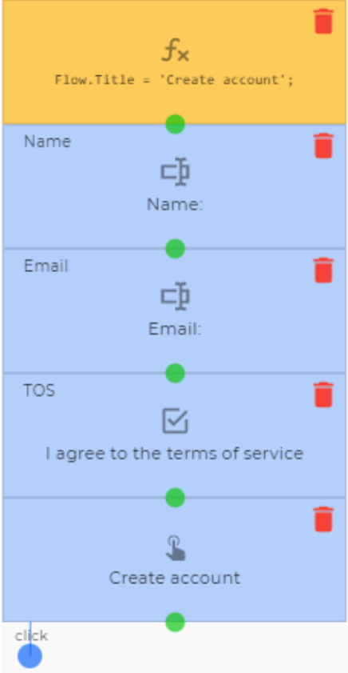

To the ‘click’ output we add a ‘Boolean logic’ node with `Nodes.TOS` written in its NodeExpression. This will check if the box was checked. To the 'false' we add an ‘Expression’ node with `"Please agree with the terms of service to create an account"` in its NodeExpression and name it ‘error’. Then we add a ‘Clear controls from screen’ to the beginning of the flow and a ‘Textual information label’ between ‘Email’ and ‘TOS’. We click on the expression button  for both Label and Visible and add `Nodes.error`. The reason this will work for visible is that a boolean will return false if empty, but if there is data it will return true, so as long as the ‘error’ node has data to reference Visible will be true, otherwise it will be false.

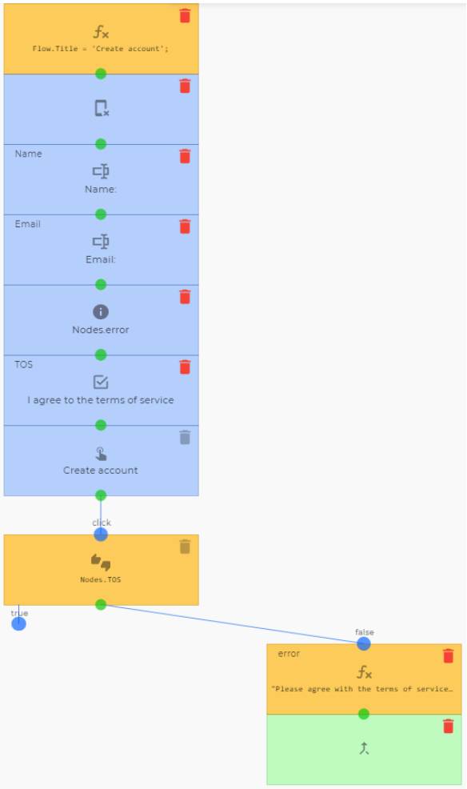

Then to the 'true' of the boolean we add a ‘Clear controls from screen’ node and an ‘Expression’ node. We name the ‘Expression’ node ‘code’ and in the NodeExpression we write `Math.random()`. This will generate a random number we will use as the verification code.
After that we add a ‘SendGrid e-mail’ node. We click the expression button  of the 'To' field and write `Nodes.Email`. In Subject we add ‘Account verification’ and in the message we click the expression button  again and add `"Verification code: "+Nodes.code`.

To the ‘Any result’ output, we add a ‘Textual information label’ node. In the textual node we click the expression button  of the label field and add `"An email has been sent to " + Nodes.Email + ". Please verify your email to complete registration"`. Just to make it a bit more clear, we check the IsHeader box too.

To the ‘Any error’ output, we also add a ‘Textual information label’ node. This one simply states “An error occurred while sending the verification email. Please try again.” Also as a header. We also add a ‘Button’ node that takes us back to the beginning.

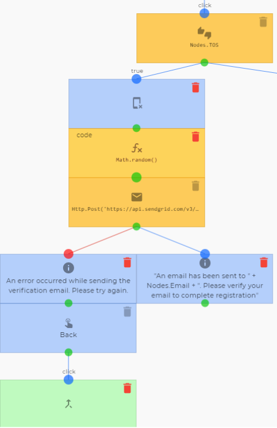

To the green dot of the other ‘Textual information label’ node we add another ‘Text input’ node. We name it ‘Verification’ and set the label to ‘Verification code:’ We also check the Mandatory box.

To this we add another ‘Button’ node with the label ‘Create account’. We make sure that the validate box has been checked. Then we add a ‘Boolean logic’ node to the ‘click’ output with `Nodes.Verification == Nodes.code` in its node expression.

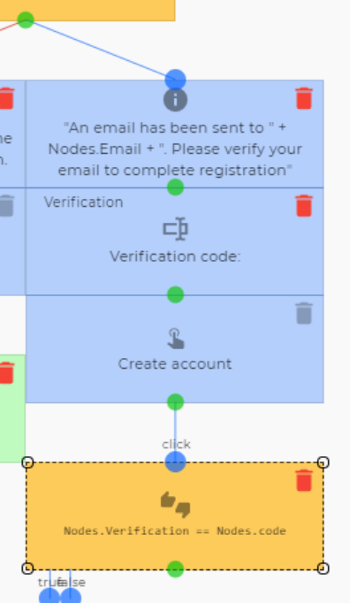

To the ‘false’ output we add an ‘Expression’ node. We name it ‘error1’ and write `"Verification code does not match, a new code has been sent"` in the NodeExpression. Above the ‘Verification’ node we add another ‘Textual information label’ node with `Nodes.error1` in its Label and Visible fields. We then drag the green dot of ‘error1’ to the ‘Clear controls from screen’ node above ‘code’.

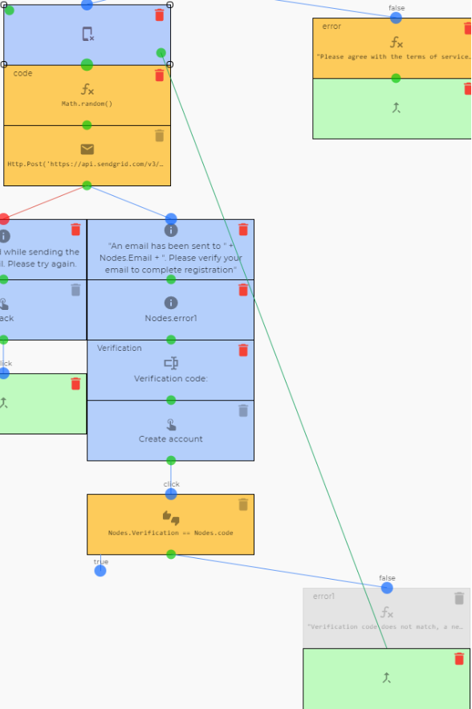

To the ‘true’ output of the ‘Boolean logic’ node we add a ‘Clear controls from screen’ and then a ‘Create (Incl. properties)’ node. We select ‘account’ as the asset type and type the following in the Properties field:

    return {
    	Name: Nodes.Name,
    	Email: Nodes.Email
    }

This will set the name and email to what the user added in these nodes. To it’s ‘Any result’ output we add an ‘Icon’ node with ‘Account created successfully’ as its label and  as the icon.

To the ‘Any error’ output we put a ‘Textual information label’ with ‘An error occurred while creating your account, please try again’ as its label. We check the IsHeader checkbox to make the text more clear. We then add a ‘Button’ node with the label ‘Back’ and connect its ‘click’ output back to the beginning of the flow.

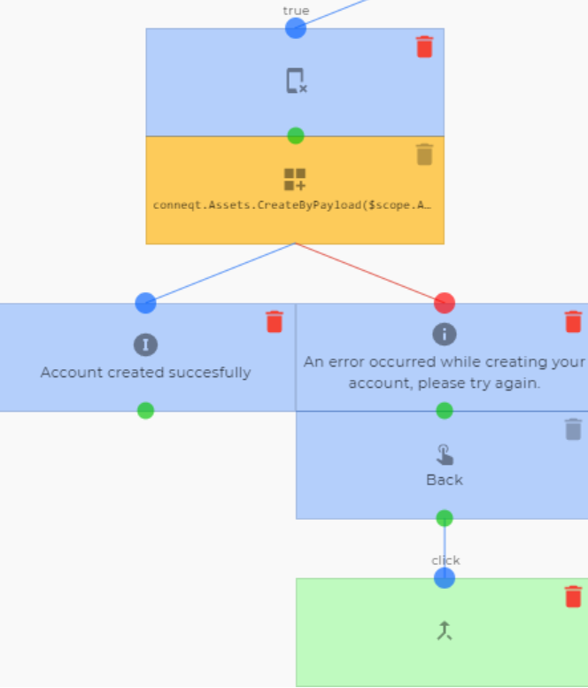

# Adding an avatar

_Nodes used:_

[Button](../../Nodes/UserInterface/Button.md)

[Clear controls from screen](../../Nodes/Display/ClearControls.md)

[Popup message](../../Nodes/UserInterface/PopupMessage.md)

[Signature](../../Nodes/UserInterface/Signature.md)

[Image upload](../../Nodes/UserInterface/ImageUpload.md)

[Update](../../Nodes/Assets/Update.md)

[Go to node](../../Nodes/Navigation/GoToNode.md)

[Result Navigation](../../Nodes/Navigation/ResultNavigation.md)

When the account is created, we want to give the user the opportunity to add an avatar. We have added a file property named ‘Avatar’ to the asset type 'Account' to be able to do so.

We start by adding a button below the ‘Icon’ node. We label it ‘Add avatar’. To its ‘click’ output we add a ‘Clear controls from screen’ and a ‘Popup message’ node with ‘Add avatar’ as the caption and ‘Chose method’ as the message. We delete the ‘ok’ output and add a ‘Draw’ and an ‘Upload’ output in its place.

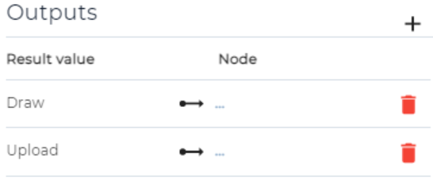

To the ‘Upload’ output we add an ‘Image upload’ node that we name ‘Avatar’. We label it ‘Upload avatar image’ and make sure the 'Mandatory' checkbox is checked.
To the ‘Draw’ output we connect a ‘Signature’ node that we also name ‘Avatar’. We label it ‘Draw an avatar’ and make sure the 'Mandatory' checkbox is checked. Then we add an ‘Button’ node to the green dot of the ‘Upload image’ node and connect the green dot of the ‘Signature’ node to it as well. We label it ‘Set avatar’.

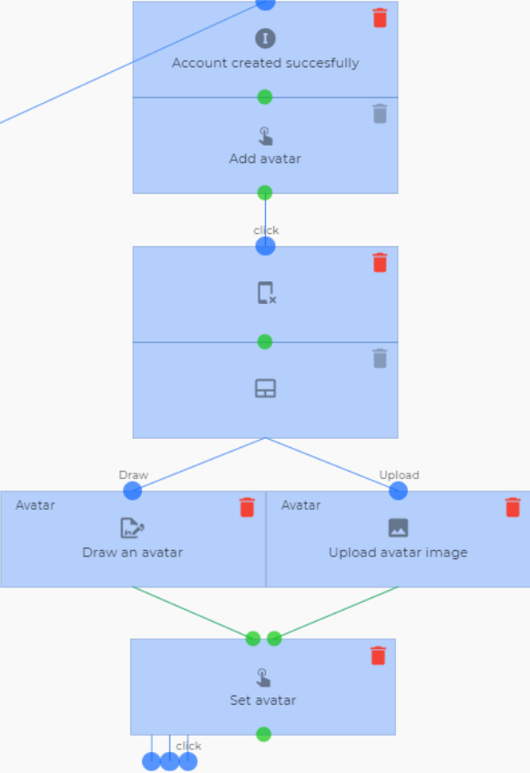

Now we go back to our ‘Create (Incl. properties)’ node that creates the account asset. We name this node ‘Account’. Then we add an ‘Update’ node to the ‘click’ output. For the AssetId we click on the expression button  and write `Nodes.Account.Identifier`. The property name we set to ‘Avatar’. For the NewValue we once again click the expression button  and write `Nodes.Avatar.Base64Thumbnail`. The reason that this will work is that the flow will only trigger one of the Avatar nodes, thus there is only one `Nodes.Avatar` to reference. To the ‘Any error’ output we once again create a short error loop as done previously. This time it loops back to the ‘Clear controls from screen’ node right before the popup message:

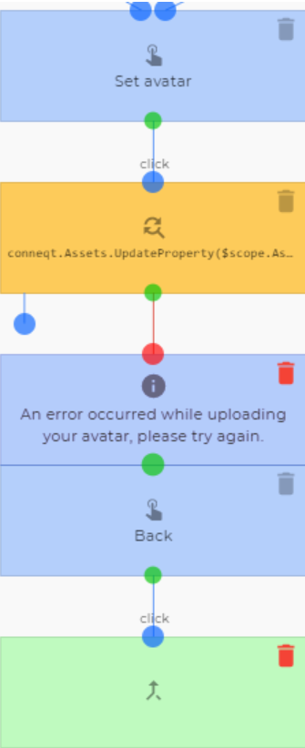

To the ‘Any result’ node we add an ‘Icon’ node labelled ‘Avatar uploaded’ With  as the icon. Then we add a ‘Button’ node labelled ‘Complete’ and to its ‘click’ output a ‘Result navigation’ node. We set its EntityType to asset and for the Identifier, we press the expression button  to add `Nodes.Account.Identifier`.

Now, once the user is done they will be taken to their account dashboard. (**Note:** this is not a conneqt account, thus it will not take them to their conneqt account page, rather it will take them to the asset that is their account that we created with this flow.)

# Full Run screenshots:

1
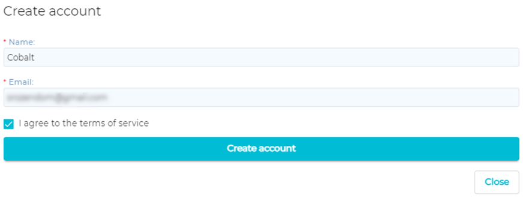

2
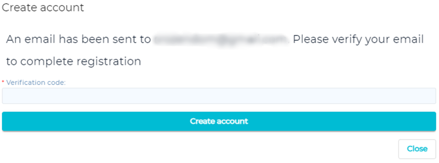

3
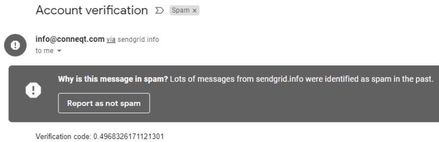

The sad truth is that a lot of spam mail is sent through SendGrid, thus the emails will most likely end up in the spam box of the recipient as of now.

4
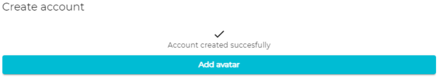
5
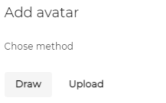

6a
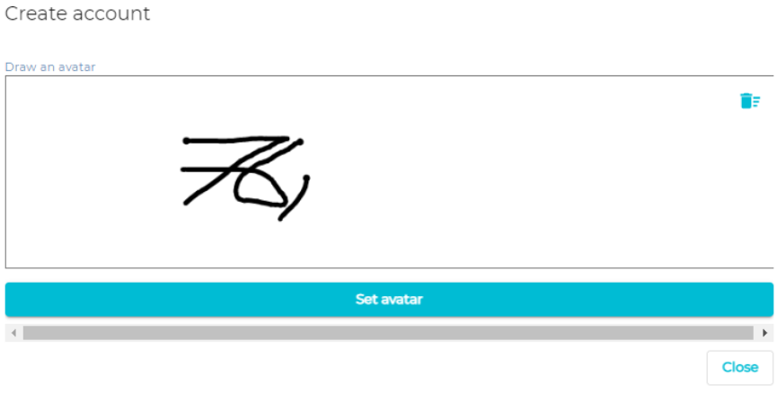

Or 6b.1
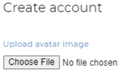

6b.2
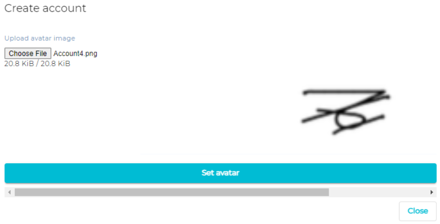

7
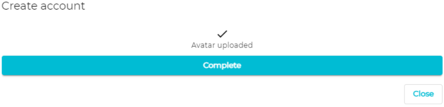

8
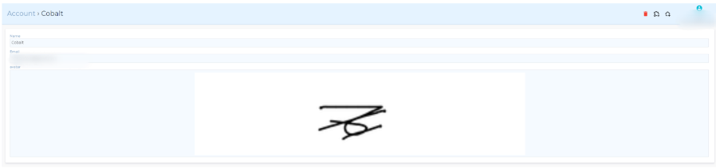
