# Desserts examples

These are a bunch of examples using the same asset set, all examples are independant of eachother.

# Aggregate

_Nodes used:_

[Aggregate](../../Nodes/Assets/Aggregate.md)

[Textual information label](../../Nodes/Display/TextualInformationLabel.md)

[Textual label](../../Nodes/Display/Label.md)

We have an asset type ‘desserts’ on which we would like to perform aggregations. The following values have been given:

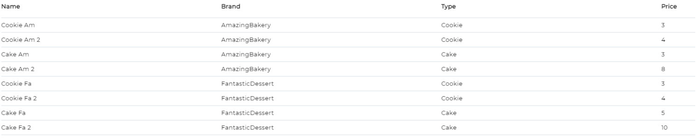

We want to group these on the type of dessert and get the average. Once we have added our Aggregate node to our flow, we select the asset type ‘desserts’ and set the ‘GroupFields’ to sort on the type of dessert: `return ['Properties.Type.Value']`. Then, we set the ‘Arrgerations’ to target the price and calculate the average:

    return [{
        AggregationField: 'Properties.Price.Value',
        AggregationFunction: 'Avg'
    }]

Clicking on the 'show return' button shows us the following:

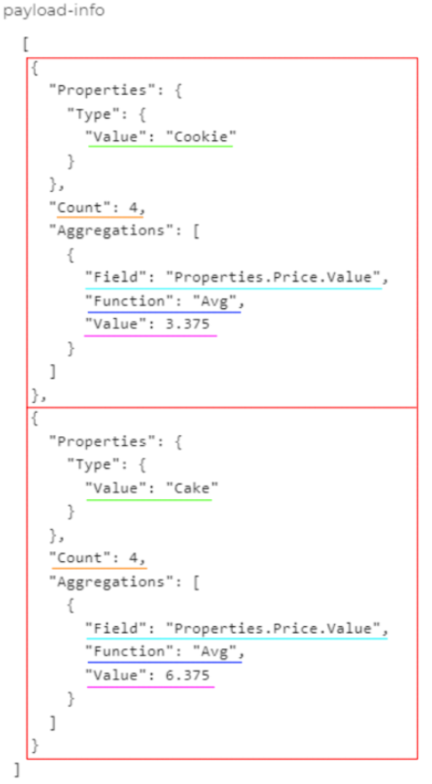

**Note:** the image has been annotated, only the text will appear in reality.
This is how the Aggregate stores its values. We can see that it has created two groups by the boxes in red. The thing it sorted the groups on has been underlined green. The amount of assets in the group is listed at the orange underlined “Count”, both 4 this time. The light blue underlined line states what property it used to perform the calculation, and the dark blue states the executed calculation. Finally, the magenta underlined line states the result. This is the part we want to use.

Then, we add two 'Textual information label' nodes to our 'Aggregate' node using the ‘Any result’ output. To make the next step easier, we name the 'Aggregate' node ‘Average’. In the Label property of the 'Textual information' nodes we write `Nodes.Average[0].Aggregations[0].Value` and `Nodes.Average[1].Aggregations[0].Value` respectively.

Running this flow shows the following:

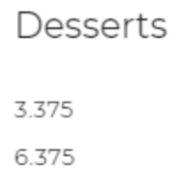

This is rather boring and it does not tell us what exactly we are seeing, thus we edit the textual label nodes to: `"The average price of a Cookie = " + Nodes.Average[0].Aggregations[0].Value` and `"The average price of a Cake = " + Nodes.Average[1].Aggregations[0].Value`

Running our updated flow will now show:

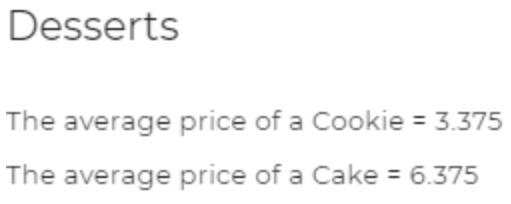

The flow itself now looks like this:

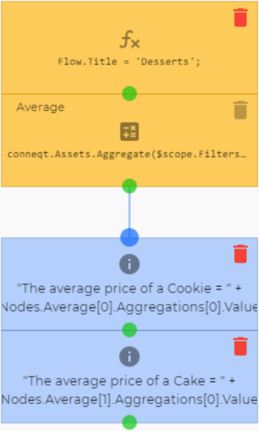

Using similar methods to create a second group, we can calculate the average price of a desert for each brand. We also use the ‘Textual label’ node to make the data a bit easier on the eyes:

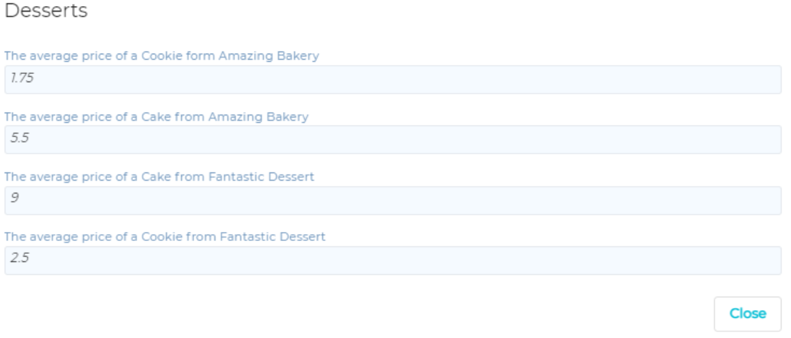

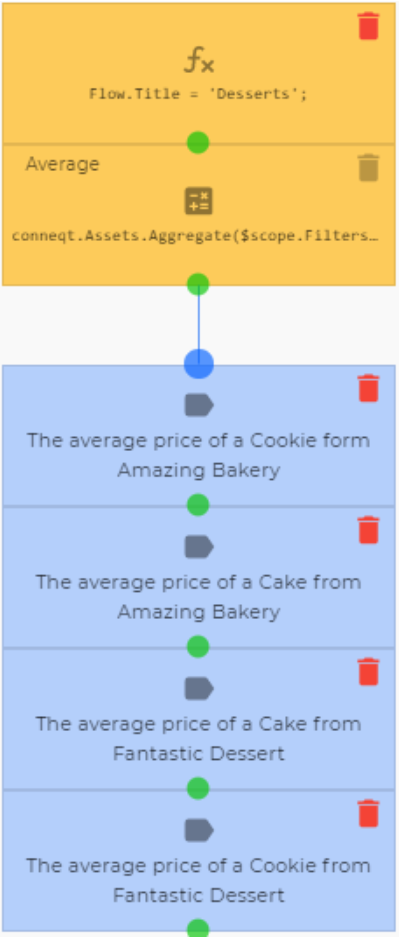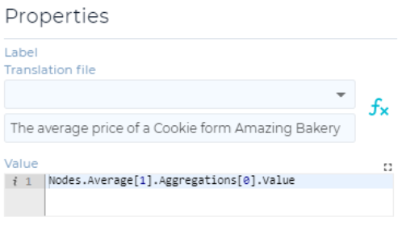

Here we can see that the desserts coming from Fantastic Dessert are more pricey than those of Amazing Bakery, especially their cakes.

# Unnecessarily difficult aggregations, and For-loops

_Nodes used:_

[Filter](../../Nodes/Assets/FilterNode.md)

[Expression](../../Nodes/Expressions/Expression.md)

[Boolean logic](../../Nodes/Expressions/Boolean%20Logic.md)

[Go to node](../../Nodes/Navigation/GoToNode.md)

[Textual information label](../../Nodes/Display/TextualInformationLabel.md)

We have an asset type ‘Dessert’, that has the property 'Type'. This property either has the value Cookie or Cake. Given certain filter parameters, we want to determine if the asset is a Cookie or a Cake, and how many of each there are. First, we create a ‘Filter’ node and name it desserts. We add the property ‘Type’ to the output of the node. Then we add an ‘Expression’ node with the following NodeExpression:

    Flow.index = 0;
    Flow.cookie = 0;
    Flow.cake = 0;

This creates 3 variables that all begin at 0. After that we add a ‘Boolean logic’ node with the NodeExpression: `Flow.index < Nodes.desserts.length`. This will check whether or not we’ve checked all the desserts.

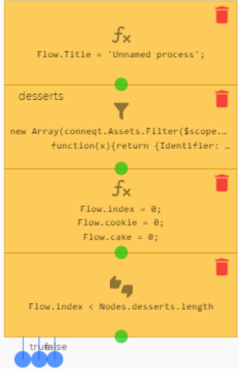

To its ‘true’ output we add another ‘Boolean logic’ node, this time with the NodeExpression: `Nodes.desserts[Flow.index].Type == "Cookie"`. This will check if the dessert is a cookie. To its true we add an ‘Expression’ node with: `Flow.cookie += 1;` to its false one with: `Flow.cake += 1;` Then, to the green dot of both we add another one with: `Flow.index += 1;`. These ‘Expression’ nodes now act as the counters of the flow. Then, we drag the green dot of the last ‘Expression’ node we created back to the first ‘Boolean logic’ node. This will create a loop that makes sure we check all the desserts. In conventional coding this is called a 'For loop'.

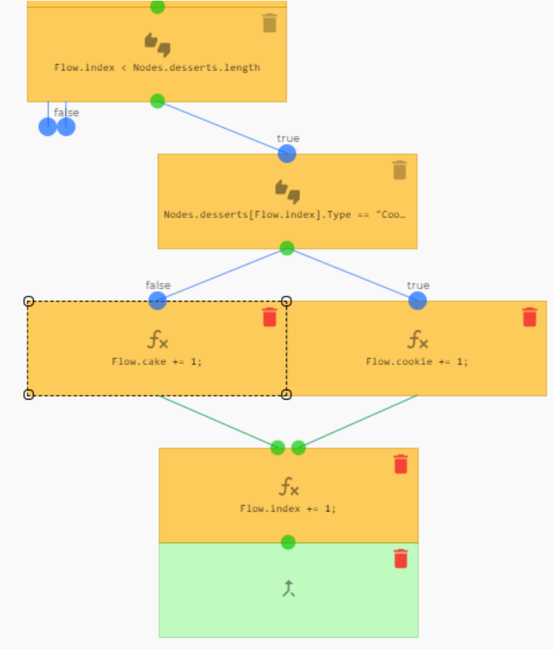

Finally, we add a ‘Textual information label’ to the false of this first ‘Boolean logic’ node. In the label we click the Expression button  and add the following line: `"There are " + Flow.cookie + " Cookies and " + Flow.cake + " Cakes"`.

Now running the program shows us our results:

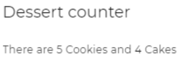

# Add a new dessert

_Nodes used:_

[Text input](../../Nodes/UserInterface/TextInput.md)

[Numerical input](../../Nodes/UserInterface/NumericInput.md)

[Button](../../Nodes/UserInterface/Button.md)

[Clear controls from screen](../../Nodes/Display/ClearControls.md)

[Create (Incl. properties)](../../Nodes/Assets/CreateByPayload.md)

[Textual information label](../../Nodes/Display/TextualInformationLabel.md)

We have an asset type ‘desserts’ containing desserts from different brands:

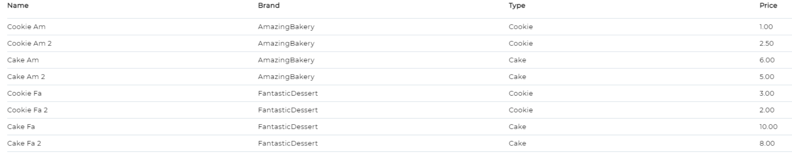

Here we want to add other desserts using a 'Create (incl. Property values)', 'Text input' and 'Numeric input' nodes, with a 'Button' node to complete the action. First, we add all the input nodes and give them appropriate names to make the process easier:

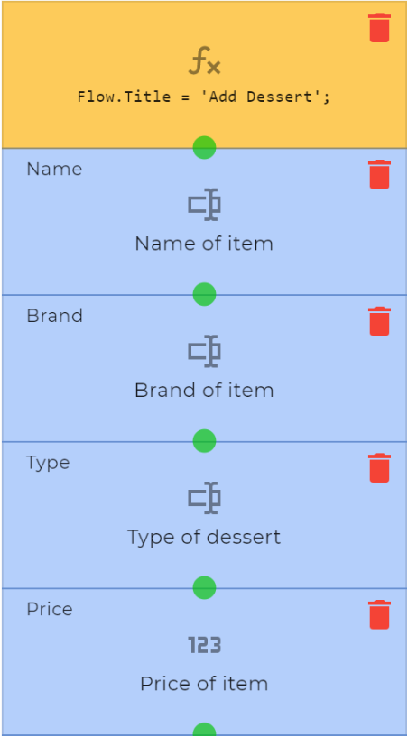

Then we can add the button. This node doesn’t require a name as it won’t be referenced. To its ‘click’ output we also add a 'Clear controlls from screen' node to make the process a bit more clear to the user.

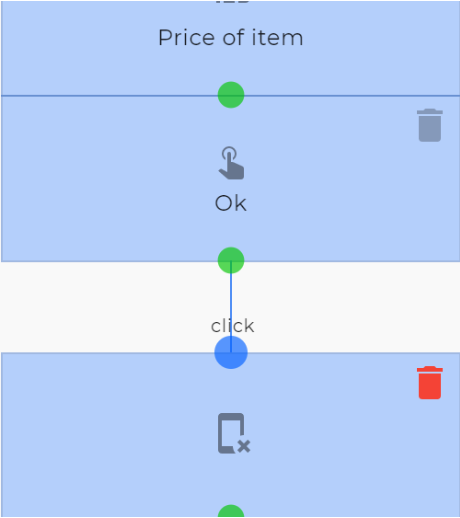

Below this, we add a 'Create (incl. Property values)' node with the correct asset type selected. Then in the ‘Properties’ expression, we add references to our 3 input nodes:

    return {
    	Name: Nodes.Name,
    	Brand: Nodes.Brand,
    	Type: Nodes.Type,
    	Price: Nodes.Price
    }

Then, to the ‘Any result’ and ‘Any error’, we add a quick message for confirmation. These will both lead into a button that when clicked clears the screen and uses ‘Jump to node’ node set to the beginning of the flow to restart the flow. This can easily be created by dragging the green dot to the top node of the flow. The flow now looks like this:

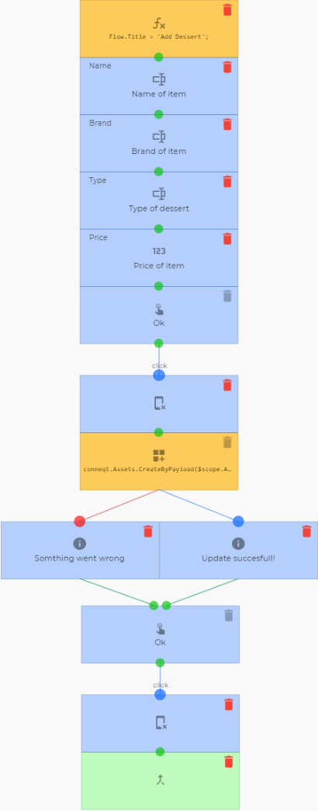

Running the flow, we see and fill in the following:

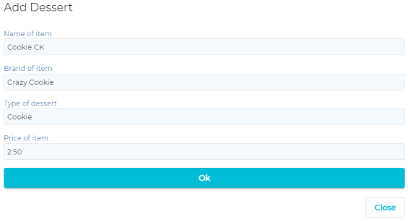

Clicking ‘Ok’ then leads us to this screen:

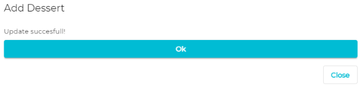

Clicking Ok again would allow us to add another dessert. If we look back at the list of desserts now, we see the following:

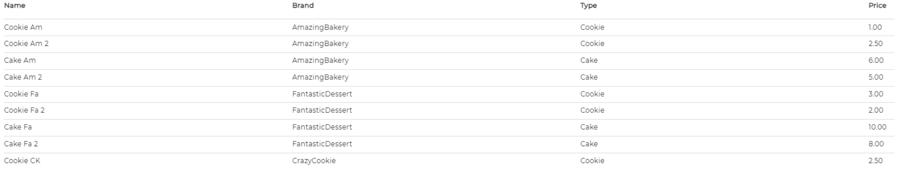

Where our new dessert has been added to the list.

# Filtering explained by use of an example

_Nodes used:_
[Filter](../../Nodes/Assets/FilterNode.md)

We have an asset type ‘desserts’ that also stores the brands of the desserts it stores. We want to generate a list of these desserts with their brands for further processing. We do this by creating a 'Filter' node named filter and selecting the ‘Desserts’ asset type. We can leave the order the same, but we add `Brand: x.Properties.Brand.Value` to the NodeExpression. This will add the brand name to each asset in the output:

    new Array(conneqt.Assets.Filter($scope.Filters, $scope.Order).Records).map(
    	function(x){return {Identifier: x.Identifier, Name: x.Name, Brand: x.Properties.Brand.Value}})

Running the flow and clicking the square brackets, we now see the following list:

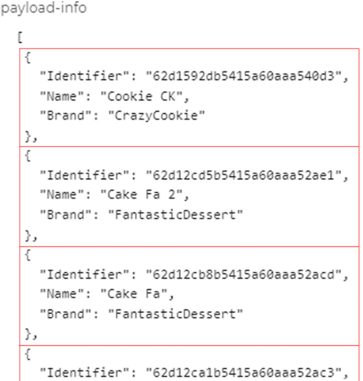

**Note:** This image has been annotated, the colors do not actually show up.

The items of the array list have been separated by the red blocks. Here we can see that the node returns the unique identifier of the asset, its name and what we wanted: its brand. If we now wanted to reference one of these items’ brand, we would do it using `Nodes.Filter[X].Brand.Value` where X is the position in the list. Keep in mind that the list is an array, so the first position is 0, the second is 1, etc.

# Batch update

_Nodes used:_
[Batch Update](../../Nodes/Assets/Batch%20update.md)

**Note:** The way this is done in this example is not the most effective way, that would simply be to use the ' maintenance' option when edditing a property on the asset type page. However, this is an effective way of showing how the 'Batch update' node works.

We have two dessert brands, AmazingBakery and FantasticDessert, that have just recently merged under AmazingBakery. We want to update our Database so that it shows the AmazingBakery brand for all the products previously manufactured by FantasticDessert. But due to the amount of different products the brand has this would not be efficient to change all the assets by hand.

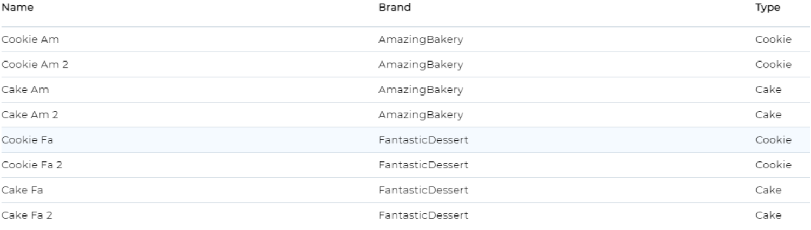

We start by creating a flow and adding a batch update node:

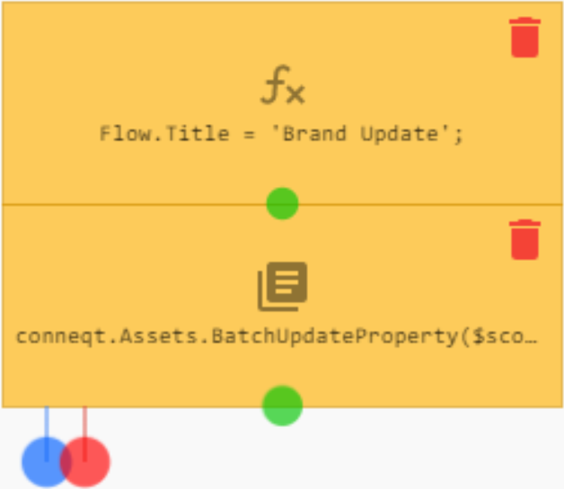

In the 'Batch Update' node we select the correct asset type and add a filter to sort on the brand we want to change. Then we type the name of the property we want to change in its field and the new value it should have in its corresponding field. Now out node menu looks like this:

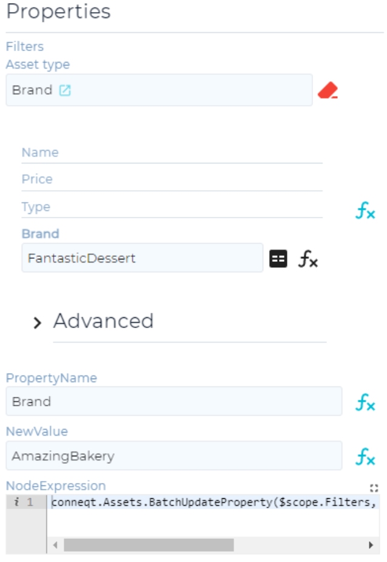

Now we can run our flow, it doesn’t have to be published as it won’t be used by other flows or triggers. If we then go back to the list of assets we started with, it now looks like this:

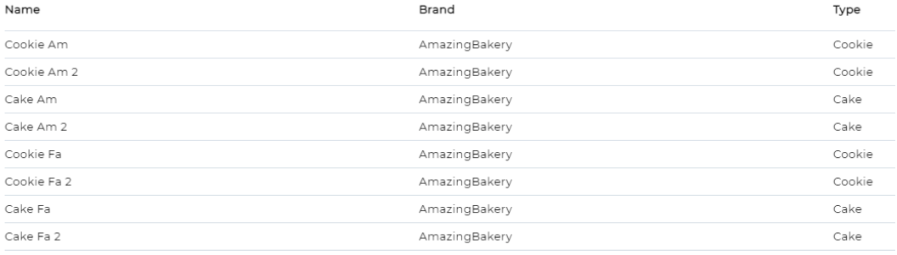

The value stored in the node is now 4, as it has updated 4 out of 8 values:

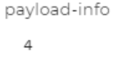
