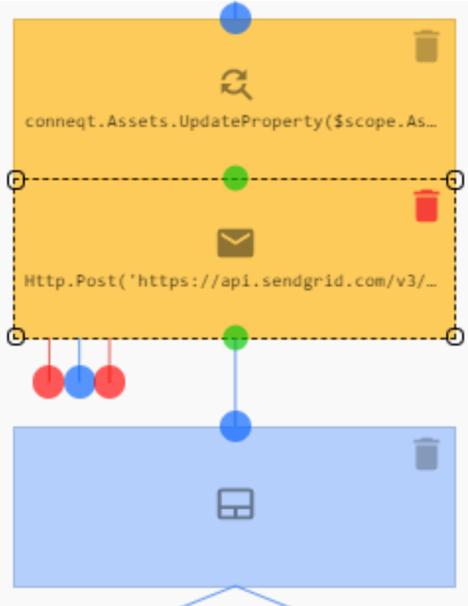
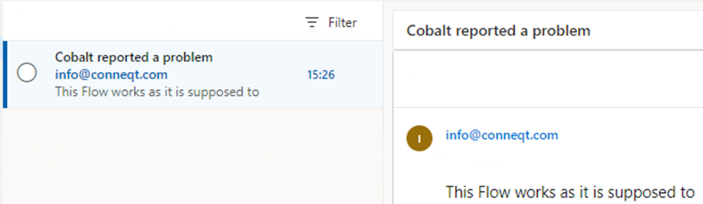
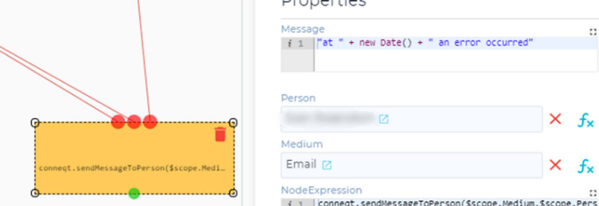
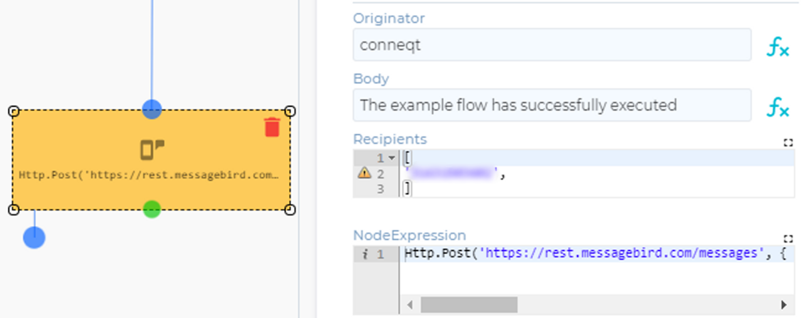

# Email

### Option 1

_Nodes used:_
[SendGrid email](../../Nodes/Communication/SendGridEmail.md)

We want to add that the [Report a problem](../../Nodes/Examples/ReportAProblem.md) flow sends an email to the person in charge of the conneqt system when a problem is reported. We do this by adding an ‘SendGrid email’ node right after the ‘Update’ node.

We fill in the email of the person responsible for the conneqt system in the ‘To’ field. For the subject we click the expression button  and add `Nodes.Name + " reported a problem"`, similarly in message we add `Nodes.ProblemDescription`.

When the flow is run, with the name ‘Cobalt’ and the problem description ‘This Flow works as it is supposed to’, the following email is sent out:

### Option 2

_Nodes used:_
[Message person using medium](../../Nodes/Communication/MessagePersonUsingMedium.md)

We have a flow running some aggregations and updates on assets within our system. Now we want to be able to send out a message to the person in charge of the conneqt system when an error occurs. This can be done very simply by connecting a ‘Message person using medium’ node connected to all the ‘any error’ outputs of the flow, with `"at " + new Date() + " an error occurred"` in the message line; the person in charge of the system selected under person and email selected under medium.

# SMS

_Nodes used:_
[MessageBird SMS](../../Nodes/Communication/MessageBirdSMS.md)

We have a flow in our program that we use to notify all the personnel of a department whenever it has successfully executed. We do this by adding a ‘MessageBird SMS’ node to the ‘Any result’ (or ‘specific result’ in certain cases) of the last Expression node. The originator we set to the department’s name, and in the Recipients we fill in all the phone numbers of those working in the department. In the body, we write “The example flow has successfully executed”

