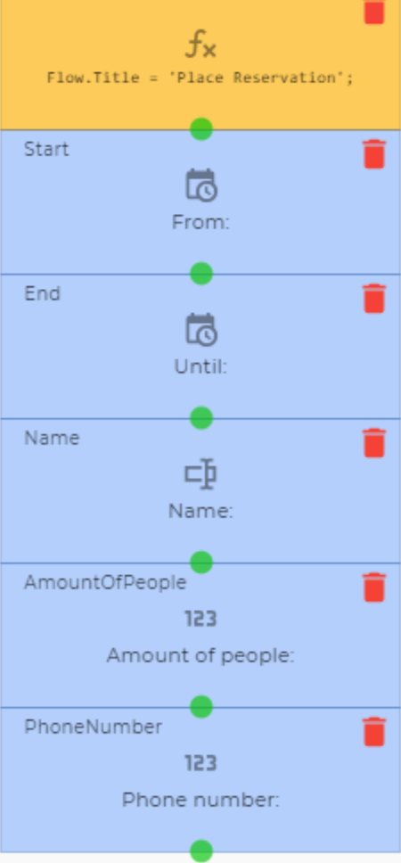
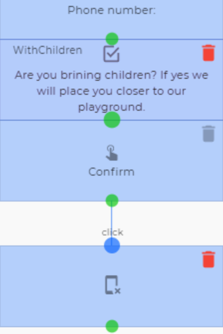
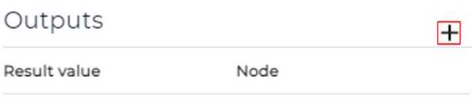
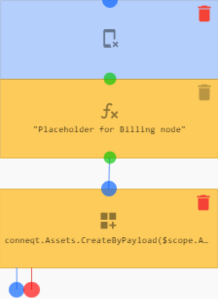
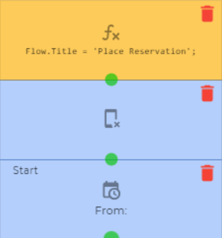
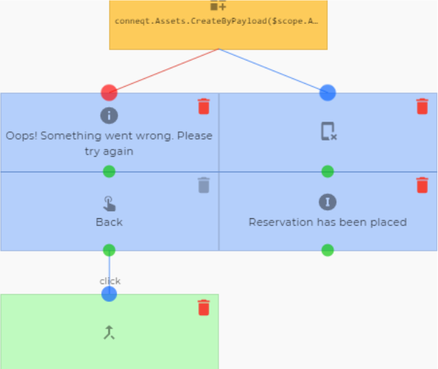
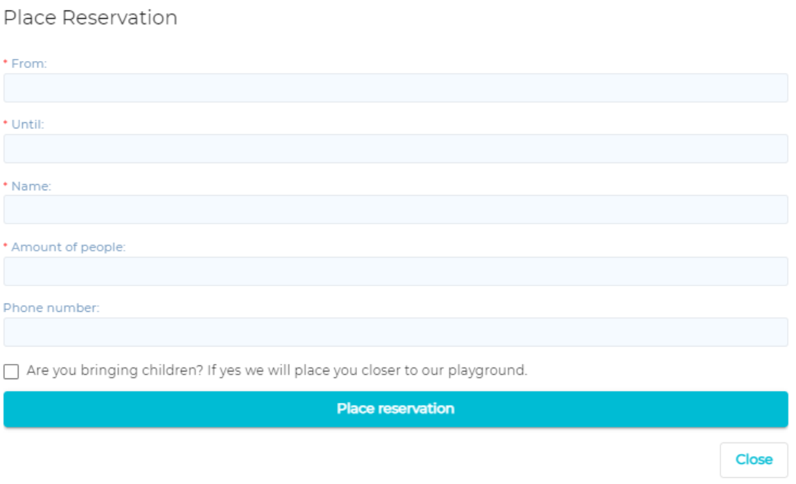
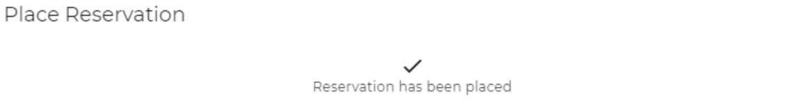
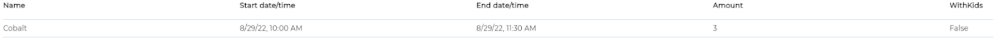
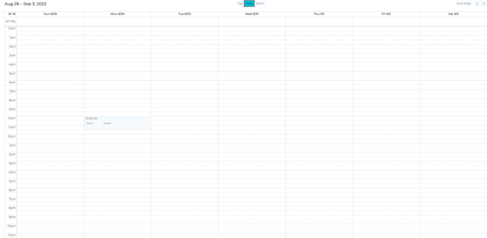

# Place a reservation

This is an example of a flow a restaurant could use for customers to place a reservation. This is a very basic flow that does **not** check availability.

_Nodes used:_

[Date and time input](../../Nodes/UserInterface/DateAndTimeInput.md)

[Text input](../../Nodes/UserInterface/TextInput.md)

[Numeric input](../../Nodes/UserInterface/NumericInput.md)

[Checkbox](../../Nodes/UserInterface/Checkbox.md)

[Button](../../Nodes/UserInterface/Button.md)

[Clear controls from screen](../../Nodes/Display/ClearControls.md)

[Create (Incl. properties)](../../Nodes/Assets/CreateByPayload.md)

[Textual information label](../../Nodes/Display/TextualInformationLabel.md)

[Icon](../../Nodes/Display/Icon.md)

[Go to node](../../Nodes/Navigation/GoToNode.md)

There is a restaurant that wants to make use of flows so customers can place reservations. The flow we will be making is a very simple flow that does not allow for table choice or checking if there is space left for the customer. The customer will be asked the time of their reservation, their name and the amount of people they’re bringing. Optionally, they can also leave their phone number for contacting and if they are bringing kids, they can be placed near the playground.

We are using an asset type ‘Reservation’ for this. It has a text property for name, two integer number properties for the amount of people and the phone number, a boolean for if they are bringing children and finally we have dragged the start time and end time built in properties into the asset dashboard.

We start the flow with two ‘Date and time input’ nodes. The first we name ‘start’ and label ‘From:’ the second we name ‘end’ and label ‘Until:’ Then we add a ‘Text input’ node that we name ‘Name’ and label ‘Name:’ and two numeric input nodes: ‘AmmountOfPeople’ labelled ‘Amount of people:’ and ‘PhoneNumber’ labelled ‘Phone number:’. All but the last we mark as mandatory.

To this we add a ‘Checkbox’ node we name ‘With children’ and label ‘Are you bringing children? If yes we will place you closer to our playground.’ Then we add a ‘Button’ node labelled ‘Place reservation’ with the validate checkbox checked. To its ‘Click’ output we add a ‘Clear controls from screen’ node.

Now below this we would add the nodes handling the billing of the possible fee that comes with placing a reservation. But, as of writing this example, conneqt does not yet support billing. Thus we add an ‘Expression’ Node as a placeholder. We do add an ‘Any result’ output to it by clicking the add output button.

To this output we add a ‘Create (Incl. properties)’ node. As the AssetType we select ‘Reservation’ and in its Properties field we add the following:

    return {
    	Name: Nodes.Name,
    	DateStart: Nodes.Start,
    	DateEnd: Nodes.End,
    	Amount: Nodes.AmountOfPeople,
    	Phone: Nodes.PhoneNumber,
    	WithKids : Nodes.WithChildren
    }

To the ‘Any result’ output we add a ‘Clear screen of controls’ and an ‘Icon’ node. We label the later ‘Reservation has been placed’ and set the icon to  .

To the ‘Any error’ output we add a ‘Textual information label’ labelled ‘Oops! Something went wrong. Please try again’. We add a ‘Button’ node labelled ‘Back’ and we drag its ‘click’ output back to the beginning of the Flow. And just to be sure everything renders correctly when the ‘Back’ button is pressed we add a ‘Clear controls from screen’ node to the beginning of the flow.

|  |
| ---------------------------------------------------------- |
|  |

Running the flow now shows the following screens:

And if we now go to the assets of ‘Reservation’ we see that our reservation has been added.

We can also see this in a planner view:

