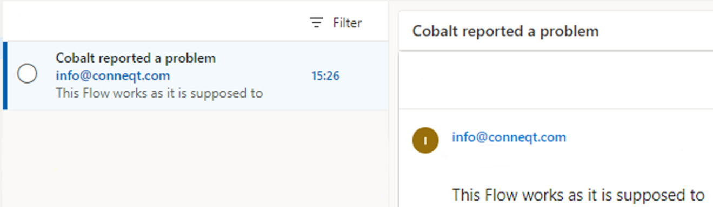

# Report a problem

This is a main example with a few possible alterations in further sub-examples. This is usefull when problems occur often enough that there is a person/team to solve them.

_Nodes used:_

[Find by identifier](../../Nodes/Assets/FilterID.md)

[Clear controls from screen](../../Nodes/Display/ClearControls.md)

[Text input](../../Nodes/UserInterface/TextInput.md)

[Button](../../Nodes/UserInterface/Button.md)

[Create (Incl. properties)](../../Nodes/Assets/CreateByPayload.md)

[Update](../../Nodes/Assets/Update.md)

[Popup message](../../Nodes/UserInterface/PopupMessage.md)

[Textual information label](../../Nodes/Display/TextualInformationLabel.md)

Problem reporting can be done through conneqt. Usually these reports have multiple statuses that have different properties tied to them. For this example we use a simple 'Problem Status' asset type, with three assets: Noted, processed and completed. These can have multiple properties, but for now we leave them with only a name. Furthermore we have an asset type 'Problem'. This asset type has a 'Name', 'Reporter' and " Description string property, a 'TimeReported' date and time property and a 'status' asset property.

We start by adding a ‘Find by identifier’ node to our flow and select the ‘Noted’ asset as the asset we want to read. We also name the node ‘Noted’.

After that, we add a bit of UI, simply allowing the user to fill in some necessary information. In this case we ask them for their name and the problem they wish to report. We also give both ‘Textual input’ nodes a name as we will be referencing them.

To the ‘click’ output we add a ‘Create (incl. properties)’ node. We set the Asset type to ‘problem’. To create an asset with a name, a reporter, a description, time of report and a status we add the folowing to the properties field:

    return {
    	Name: 'Problem reported by: ' + Nodes.Name,
    	Reporter: Nodes.Name,
    	Description: Nodes.ProblemDescription,
    	TimeReported: new Date()
    }

We also name the node ‘NewProblem’. Then we add an ‘Update’ node to the ‘any result’ output of the ‘Create (inlc. properties) node. We click the expression button  on the AssetId of the node to fill in `Nodes.NewProblem.Identifier`, so that the update will target the asset we just created. In the ‘PropertyName’ field we write ‘Status’. For the ‘NewValue’ field we once again press the expression button  to fill in `Nodes.Noted` . To the ‘any result’ output of the ‘Update’ node, we add a Popup message. With a message stating “Do you wish to report another problem?” and a ‘Yes’ and ‘No’ specific output. The ‘Yes’ output we drag back to the first node to create a ‘Jump to node’ node and we add a little message of thanks to the ‘No’ output. Our flow now looks like this:

Running the program will show us the following screen:

Then, once we have filled in the information, we click report:

Clicking no:

Then, if we go to the assets of the ‘Problem’ asset type, we see our reported problem.

# Email

_Node added:_
[SendGrid email](../../Nodes/Communication/SendGridEmail.md)

Now we want to add that the flow sends an email to the person in charge of the conneqt system once a report is made. We do this by adding an ‘SendGrid email’ node right after the ‘Update’ node.

We fill in the email of the person responsible for the conneqt system in the ‘To’ field. For the subject we click the expression button  and add `Nodes.Name + " reported a problem"`, similarly in message we add `Nodes.ProblemDescription`.

When the flow is run, with the name ‘Cobalt’ and the problem description ‘This Flow works as it is supposed to’, the following email is sent out:

# Location

_Node added:_
[Get geo-location](../../Nodes/UserInterface/GetGeoLocation.md)

We also want to know the location of the problem. For this we will use the ‘Get geo-location’ node. We place it right after the report button and name it ‘Location’. We reconnect the flow with the ‘Any result’ output. As all assets have a built in geo-location property, we don’t need to add it.

We open the ‘NewProblem’ node because we have to add LocationPoint: `Nodes.Location`, to the properties tab. This is enough to get a location with each report.

# Status Update

_Nodes used:_

[Clear controls from screen](../../Nodes/Display/ClearControls.md)

[Filter](../../Nodes/Assets/FilterNode.md)

[UI navigate](../../Nodes/UserInterface/UINavigate.md)

[Data Grid](../../Nodes/UserInterface/DataGrid.md)

[Dropdown select list](../../Nodes/UserInterface/DropdownSelectList.md)

[Textual information label](../../Nodes/Display/TextualInformationLabel.md)

[Button](../../Nodes/UserInterface/Button.md)

[Multi-property update](../../Nodes/Assets/MultiPropertyUpdate.md)

[Go to node](../../Nodes/Navigation/GoToNode.md)

Now that we can report problems, we also want to be able to change their status when we fix them. We do this using a new flow.

We start by adding two ‘Filter’ nodes. Both have the AssetType ‘Problem’ but one has status ‘Noted’ and is named filterNoted, the other has status ‘Processed’ and is named filterProcessed. We also have both return the Reporter and the Description properties of the assets they find by adding the following expression to the NodeExpression:

    new Array(conneqt.Assets.Filter($scope.Filters, $scope.Order).Records).map(
    	function(x){return {Identifier: x.Identifier, Name: x.Name, Reporter: x.Properties.Reporter.Value, Description : x.Properties.Description.Value,}})

We then add two ‘UI Navigate’ nodes. In their Badge we write `Nodes.filterNoted.length` and `Nodes.filterProccesed.length` respectively.

To both ‘click’ output we add a ‘Clear controls from screen’ node and a ‘Data grid’ node. Both the ‘Data grid’ nodes we name ‘Grid’ and we make sure the Selectable checkbox is unchecked. We set their height to 1000 with a row height of 100. This will show 10 rows per page. In the DataSource field, there is a bunch of text. We remove all of it and add `Nodes.filterNoted` to the 'click' output connected to ‘Noted’ and `Nodes.filterProccesed` to the 'click' output connected to ‘Processed’. Then, in the grid definition, we press the add row  and add column  both once. In the top Left we set the'Property to show as text' to ‘Reporter’ and the top Right to ‘TimeReported’. Then we drag across both the bottom cells to create one bigger cell and set it’s property name to ‘Description’. We then set the row sizes to ‘1fr’ and ‘3fr’ and the column sizes to ‘1fr’ and ‘5fr’. 'fr' here stands for fractions, thus the rows are 1/4th and 3/4th of the width respectively.

Both the ‘Data grid’ nodes should be exactly the same exept for their DataSource.

We connect both the ‘Any result’ outputs to a ‘Clear controls from screen’ node and add another ‘Filter’ node to it. This time we only set the Asset type to ‘Problem status’. (This is the asset type used to set the status of the ‘Problem’ asset). To the ‘Any result’ output we add a ‘Textual information label’. On the label we press the expression button  and add `Nodes.Grid.Name`. We also check the isHeader checkbox. We add another 'Textual information label' and set the label to `Nodes.Grid.Description`, but we do not check the isHeader checkbox.

To those we add a ‘Dropdown select list’. We set its name to Select, the DefaultValue to 2 and the DataSource to `Nodes.Status`. Then we add a column by pressing the add column button  and set its BoundProperty to ‘Name’. To the green dot we then add a ‘Button’ node labelled ‘Submit’.

To the ‘click’ output of the 'button node, we add a ‘Clear controls from screen’ and a ‘Multiple-property update’. On the assetId we press the expression button  and add `Nodes.Grid.Identifier`. In its properties we write:

    return {
    	Name: Nodes.Grid.Name +"*",
    	Status: Nodes.Select
    }

This will add a star to the name of any problem who's status has been changed. (The ammount of stars is the ammount of changes done to the status of the problem.) This doesn't have much use other than to show the program works and could be removed once testing is done.

We add a ‘Textual information node’ to both its ‘any result’ labelled ‘The status has been adjusted’, and to its ‘any error’ labelled ‘Something went wrong, please try again.’ To this node we also add a ‘Button’ labelled ‘Back’ and drag its ‘click’ output to the beginning of the flow. Finally, we add a ‘Clear controls from screen’ node right at the beginning of the flow

Running the flow shows the following screens:

We select ‘Noted’:

We select a problem:

We set the status to ‘Processed’

Running the flow again now shows us a new pocessed problem and one less noted problem:

Clicking through ‘Processed’, we can find the one we just changed by the star at the end of the name. However if multiple problems have had a status update, they may have the same ammount of stars.

