# (Dynamic) SubFlow
_Nodes used:_

[Button](../../Nodes/UserInterface/Button.md) (superficially)

[Popup message](../../Nodes/UserInterface/PopupMessage.md)

[Result action](../../Nodes/Navigation/ResultAction.md)

[Run subflow](../../Nodes/Navigation/RunSubflow.md)

[Expression](../../Nodes/Expressions/Expression.md)

[Run dynamic subflow](../../Nodes/Navigation/RunDynamicSubflow.md)

We have an end of a flow, where we want the user to select the next flow to be executed. We want to do this using dynamic subflows. First we add a ‘Button’ node for the user to confirm that they have completed all actions of the flow. (e.g. a submit button) To its ‘click’ output we add a ‘Popup message’ node. As its Caption we set “Next Flow” and as its message “Choose Flow to execute next”. We then add two outputs named after the flows we want the user to be able to start. 

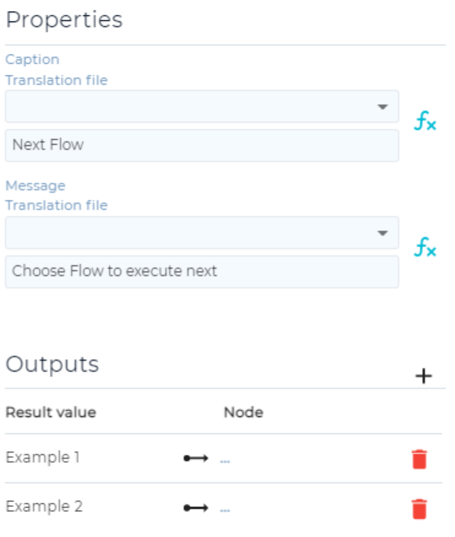

Then, we select both nodes and select the ‘Create subflow’ button 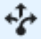. We also rename the output nodes that were created this way.

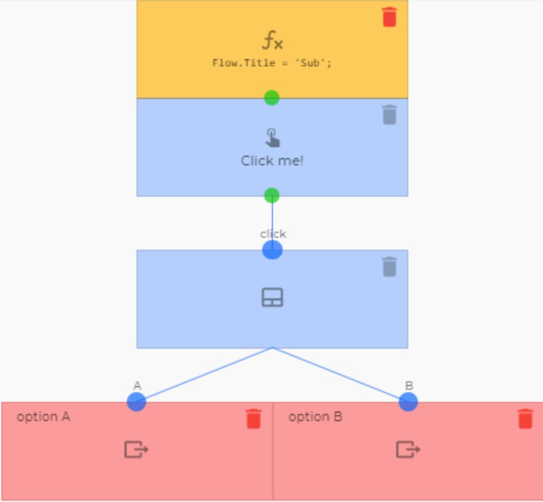

Returning to our original flow, the subflow node now has two outputs named ‘option A’ and ‘option B’. We add an ‘Expression’ node to each. In their nodeExpression fields, we simply copy the Identifier of one of the flows we want to be able to run. We also name both ‘Flow’. It is important they have the same name.

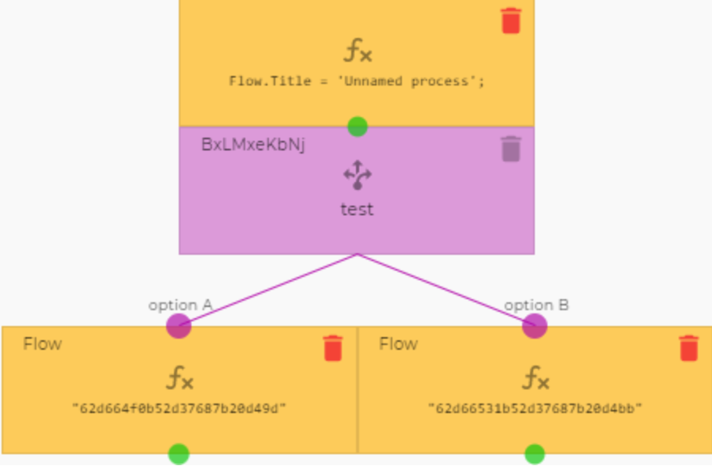

To their green dots we add a ‘Run dynamic subflow’. In the FlowId field we set any arbitrary flow, preferably one that only results in an error and doesn't acutually change somthing in the tennant. Then in the DinamicFlowId field, we write `Nodes.Flow`. This will reference the last node named ‘Flow’ that was run.

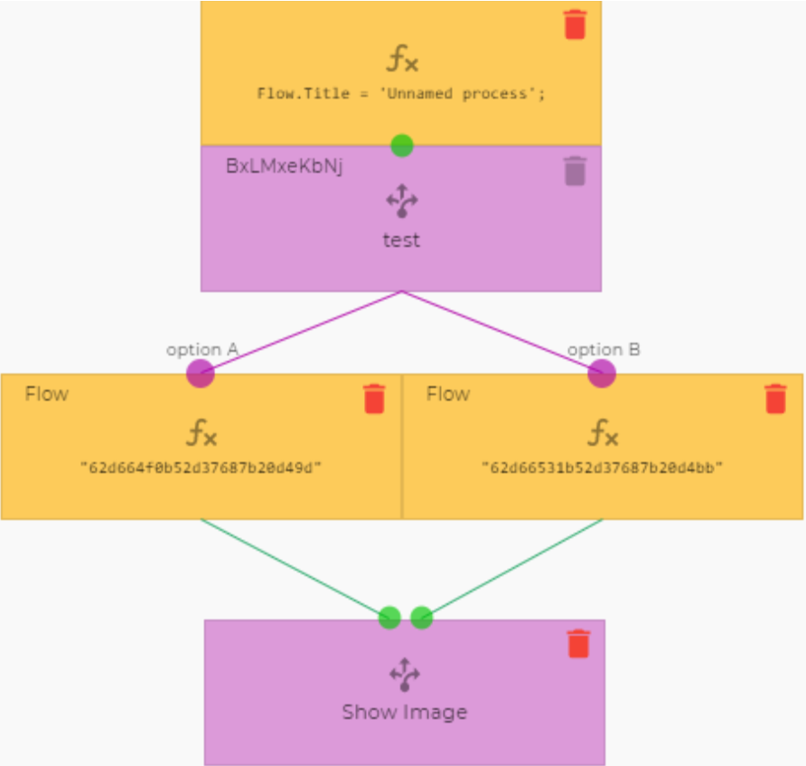

# Follow up flow
_Nodes used:_

[Button](../../Nodes/UserInterface/Button.md) (superficially)

[Popup message](../../Nodes/UserInterface/PopupMessage.md)

[Follow up flow](../../Nodes/Navigation/RunFollowUpFlow.md)

[Icon](../../Nodes/Display/Icon.md)

We are creating a flow. At the end of the flow, we want to give the user the option to start one of two flows. First we add a ‘Button’ node for the user to confirm that they have completed all actions of the flow. (e.g. a submit button) To its ‘click’ output we add a ‘Popup message’ node. As its Caption we set “Next Flow” and as its message “Choose Flow to execute next”. We then add two outputs named after the flows we want the user to be able to start. 

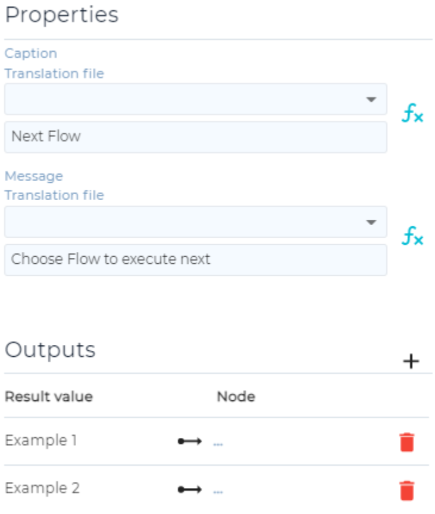

To these outputs we connect two ‘Follow up Flow’ nodes with the Flows we want to execute selected.

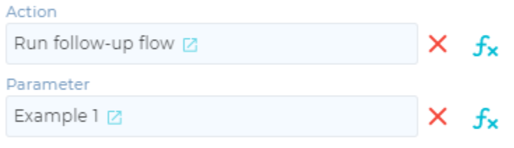

The end of our flow now looks like this:

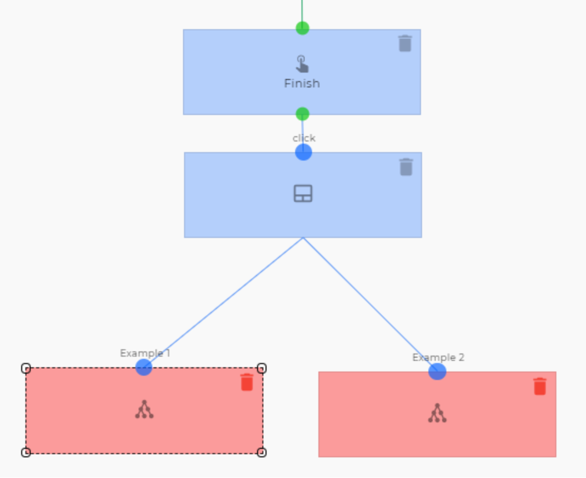

Example flows:

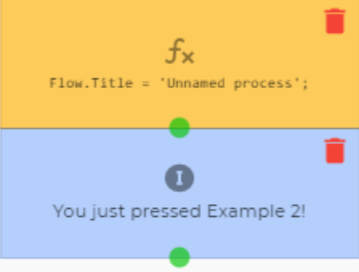

Clicking through the flow now shows us these screens:

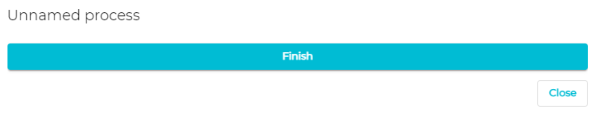
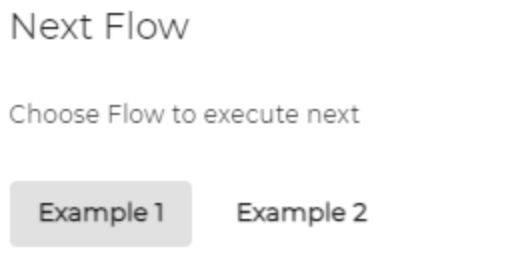
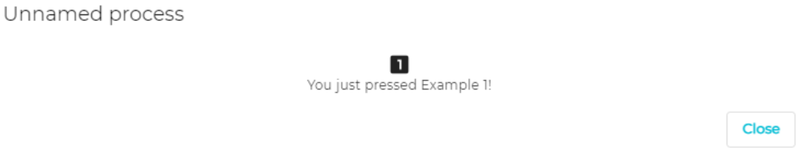

