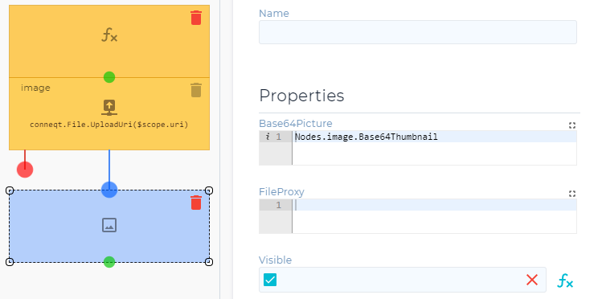

# Using an image

A short example how to add images as an UI element.

_Nodes used:_

[Save file from the web to conneqt](../../Nodes/Save/SaveFileFromWeb.md)

[Image](../../Nodes/Display/Image.md)

[Image upload](../../Nodes/UserInterface/ImageUpload.md)

We add an ‘Save file from the web to conneqt’ node we call image and an ‘Image’ node to the flow. In the uri field of the ‘save file’ node we add the link to an image we have stored somewhere else on the web. Then in the image we add `Nodes.image.Base64Thumbnail` to the Base64Picture field.

Running this flow will show our picture in the UI:

We can see that the image is much too big for the current UI, so we set the height in the ‘Image’ node to 100. Running it again will show a much better image. It is also possible to replace the File upload node with an ‘Image upload’ node if the user has to upload the image. The only thing that needs to change after adding the node is that the node needs to be named ‘image’.
